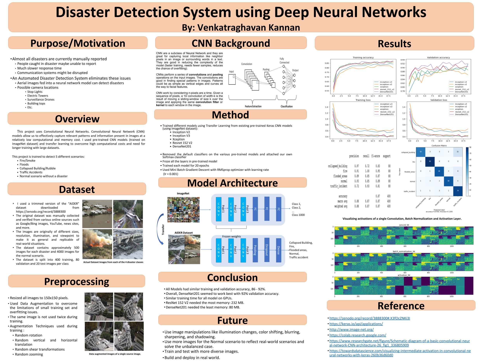

[Project Report can be found here](report.pdf)

This project uses Convolutional Neural Networks. Convolutional Neural Network (CNN) models allow us to effectively capture relevant patterns and information present in images at a relatively low computational and memory cost. I used pre-trained CNN models (trained on ImageNet dataset) and transfer learning to overcome high computational costs and need for longer training with large datasets.  

This project is trained to detect 5 different scenarios: 
* Fire/Smoke,
* Floods,
* Collapsed Building/Rubble,
* Traffic Accidents,
* Normal scenario without a disaster

   
### Model Architecture
    

